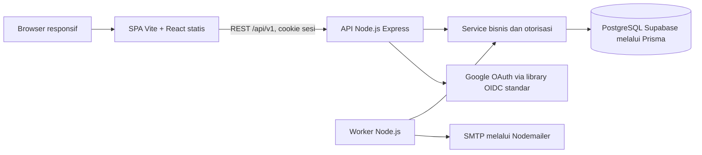

# Arsitektur Tracker

Versi 0.4. Tanggal: 20 September 2026. Status: rancangan backend MVP; frontend SPA telah dibangun, backend/database belum diimplementasikan. Bukan bukti deployment atau pengukuran runtime. Revisi 0.4 menyelaraskan arsitektur ke implementasi: SPA Vite + React, API Node terpisah, dan PostgreSQL terkelola Supabase (lihat DECISIONS D-40..D-45).

## Komponen

Frontend adalah Single Page Application berbasis Vite + React 19 + TypeScript dengan react-router-dom untuk routing sisi klien; dibangun menjadi aset statis dan tidak menjalankan kode server. Backend adalah service Node.js + TypeScript terpisah (Express) yang menyediakan kontrak REST `/api/v1`; SPA mengaksesnya via HTTP dengan cookie sesi. Tidak ada Server Components — setiap muat data melewati API, dan pemeriksaan pemilik wajib pada tiap endpoint. Struktur kode yang direncanakan: `web/src` untuk SPA (sudah ada di repo saat ini), `api/src/modules` untuk service/validasi/repository per domain, dan `api/src/worker` untuk pekerjaan terjadwal.

Prisma mengelola akses data dan migrasi terhadap PostgreSQL Supabase; constraint yang tidak didukung deklarasi Prisma dibuat melalui SQL migrasi, termasuk partial unique Pomodoro running/paused dan interval terbuka, CHECK, serta FK komposit. Supabase menyediakan Postgres terkelola; Storage dan Edge Functions tersedia sebagai opsi platform tetapi tidak dipakai untuk inti MVP. Row Level Security boleh diaktifkan sebagai defense-in-depth, tetapi otorisasi pemilik tetap ditegakkan di service aplikasi (query dibatasi user_id), bukan hanya mengandalkan RLS. Event/revisi dibuat pada transaksi domain yang sama dan akses UPDATE/DELETE-nya ditolak untuk role runtime. Urutan migrasi mengikuti SCHEMA; Task/FinanceTransaction tidak merujuk aturan M4 sebelum tabelnya tersedia. Zod memvalidasi input. UI menggunakan React dan CSS responsif; identitas visual mengikuti [DESIGN](DESIGN.md).

Pilih versi paket stabil yang kompatibel saat fondasi, kunci dalam lockfile, dan buktikan Google OAuth + login email/password bekerja pada smoke test sebelum membangun modul bisnis. Vitest untuk aturan bisnis, PostgreSQL test untuk integrasi, Playwright untuk browser. Versi paket runtime harus diverifikasi dari lockfile pada tahap implementasi backend; dokumen ini tidak membuktikan kompatibilitasnya.

Referensi primer: [Vite](https://vite.dev/guide/), [Express](https://expressjs.com/), [Supabase PostgreSQL](https://supabase.com/docs/guides/database/overview), [Prisma dengan Supabase](https://supabase.com/docs/guides/database/prisma), [openid-client](https://github.com/panva/openid-client). Referensi tidak merupakan bukti bahwa proyek sudah memakai teknologi tersebut.

## Alur request dan data

1. API membaca sesi dan memeriksa User/session_version. Auth publik dan profil minimal preverified dibedakan dari bisnis verified.
2. Validasi struktur input/filter/CSRF; baca replay idempotensi sukses bila key cocok setelah otorisasi.
3. Service membatasi query dengan user_id, mengunci User/resource, dan merekonsiliasi deadline Pomodoro untuk request yang relevan.
4. Periksa version terkini lalu status/relasi/domain. Tulis resource dan TaskEvent/revisi/interval dalam transaksi yang sama; cursor recurrence tidak menaikkan versi konfigurasi.
5. Kembalikan DTO eksplisit setelah commit. UI memperbarui setelah konfirmasi dan refresh bila replay berasal dari state lama.

Resource milik orang lain diperlakukan sebagai 404. Jangan menerima user_id dari payload bisnis. Response/cache data pribadi memakai `Cache-Control: private, no-store`; server tidak berbagi hasil query personal melalui cache global. Logout dan pergantian akun membersihkan cache browser. CSV memanggil service laporan yang sama.

## Autentikasi

API Node menangani OAuth Google (via library OIDC standar) dan login email/password dengan JWT berumur maksimum 7 hari dalam cookie HttpOnly/Secure/SameSite=Lax pada produksi. Tidak memakai Auth.js maupun Supabase Auth; seluruh logika sesi adalah kode aplikasi. JWT membawa sub, sid acak per login, recent_auth_at dari server, dan session_version; setiap akses protected memeriksa DB sehingga reset kata sandi/logout seluruh perangkat mencabut token lama. Logout satu perangkat menghapus cookie; endpoint logout-all menaikkan versi sesi dan menghapus cookie pemanggil. Semua perangkat termasuk perangkat aktif harus login kembali. UI default Inggris memakai “Log out of all devices” dengan penjelasan “You will also be logged out on this device. Log in again to continue.” Padanan Indonesia “Keluar dari semua perangkat”.

Login email/password tidak otomatis mengelola registrasi, verifikasi, hash, atau reset; semuanya logika aplikasi. Aplikasi menyimpan Argon2id hash, token acak minimal 32 byte sebagai hash, email outbox, dan rate limit di PostgreSQL. Kata sandi 12..128 karakter; jangan menulis password/token/OAuth code ke log. Verifikasi/setup kedaluwarsa 24 jam, reset 30 menit. Reset token sekali pakai menaikkan session_version.

Email dinormalisasi trim/lowercase dengan uniqueness atomik. Login email tidak membedakan akun salah dan password salah. Registrasi dan permintaan reset/kirim ulang memberi pesan umum untuk mencegah pengungkapan keberadaan email. Google baru membutuhkan verified email. Jika Google memiliki email yang sudah digunakan metode lain, login ditolak dengan instruksi penautan dari sesi lama; opsi auto-link berbasis email dinonaktifkan.

Penautan Google memakai flow OAuth dari Settings, sesi yang baru diautentikasi <=10 menit, intent sekali pakai pada AuthLinkIntent yang terikat hash sid sesi, dan email Google terverifikasi yang sama. POST link menghasilkan token intent acak yang disimpan sebagai hash di DB dan cookie HttpOnly/Secure/SameSite=Lax pada path callback. Callback OAuth custom (`/api/v1/auth/google/callback`) tetap memvalidasi state/PKCE/nonce melalui library OIDC; intent penautan bukan pengganti proteksi OAuth. Handler server memverifikasi intent, sesi user/sid, verified email, lalu mengonsumsi intent dan membuat AuthAccount atomik. Cookie intent invalid/expired membuat link gagal tanpa fallback login/registrasi; cookie dibersihkan setelah callback. Integrasi handler/callback dibuktikan smoke test pada versi library OIDC yang dikunci di M0. Jika provider identity sudah milik user lain, tolak. Menambahkan password pada Google-only memerlukan sesi baru serta token setup yang dikirim ke email terverifikasi. Melepas Google memerlukan reautentikasi dan password aktif; metode login terakhir tidak boleh dilepas. Token verifikasi tidak pernah menjadi sesi login otomatis.

Endpoint mutasi browser memeriksa origin yang diizinkan dan token CSRF terikat sesi/pre-session, termasuk login/registrasi/reset. SPA dan API disajikan pada origin yang sama melalui reverse proxy sehingga cookie SameSite=Lax dan proteksi CSRF berlaku dan CORS lintas origin tetap dinonaktifkan; bila terpaksa memakai origin terpisah, aktifkan allowlist CORS eksplisit dengan cookie kredensial dan SameSite=None (lihat DECISIONS D-44). Flow OAuth memakai proteksi state/PKCE/nonce dari library OIDC; setiap endpoint kustom tetap memerlukan proteksi sendiri.

Rate limit default: login 10 percobaan/15 menit per IP+email, endpoint pengiriman email 3/jam per email dan 20/jam per IP, API bisnis 120 request/menit per user. Respons 429 menyertakan Retry-After. Angka tersebut batas rancangan dan dapat dituning setelah pengukuran. Proxy IP hanya dipercayai dari ingress yang dikonfigurasi.

## Pomodoro dan data historis

Pomodoro menggunakan state per pengguna, PomodoroDay unik per tanggal dengan zona snapshot, sesi fase yang menaut Day saat start, dan interval running. Server deadline adalah sumber kebenaran; fokus 1500 detik, short_break 300, long_break 900. Pause menutup interval, resume membuat interval baru dan due_at dari sisa. Worker/request yang menemukan deadline lewat memfinalisasi tepat pada due_at. Completed focus memperbarui count/next_phase sekali; tidak ada auto-start atau inferensi bahwa Task ikut selesai.

GET active/history/report dapat merealisasikan status yang sudah selesai berdasarkan deadline. Finalisasi di bawah lock User idempotent dan tidak menjalankan fase baru. Fokus running/paused memblokir done/pindah/arsip Task dan complete/archive Project; teks/priority/due_date tetap editable. Break tanpa tugas tidak memblokir domain proyek.

TaskEvent dan snapshot mempertahankan penyelesaian/proyek lama saat reopen/pindah/rename. Laporan tugas memakai event, sedangkan progres proyek memakai keadaan sekarang. Focus terminal completed/cancelled memakai overlap interval dan snapshot; break/pause tidak dihitung. archived_on dan jadwal habit mempertahankan batas tanggal bisnis pada zona habit yang disalin saat create; perubahan zona profil tidak membuat jadwal lama menjadi editable kembali.

FinanceTransactionRevision dan FinanceAccountBalanceChange bersifat immutable, tetapi laporan keuangan mengikuti transaksi terkoreksi saat ini. Koreksi/void dapat mengubah arus laporan lampau; koreksi saldo awal mengubah saldo akun, bukan arus pendapatan. Service laporan membaca snapshot DB konsisten, mengagregasi milidetik sebelum pembulatan, dan memakai algoritme sama pada CSV.

## Timebox dan kemampuan turunan

TimeboxPlanning service menyimpan rencana UTC dan tautan Task/Habit; list memakai irisan batas hari lokal profil. Rencana tidak menghasilkan event penyelesaian, check-in, transaksi, atau sesi Pomodoro. Tidak ada worker eksekusi Timebox. Dashboard hanya memuat Timebox, tugas, kebiasaan, dan Pomodoro; tidak memanggil service keuangan untuk rincian dashboard.

Pomodoro completed memperbarui Day sesi dan State di bawah lock User. Saat idle, pilih Day tanggal lokal profil: Day baru focus/0, Day lama dipakai kembali. Sesi terbuka mempertahankan Day meski melewati tengah malam atau profil berganti zona. today pada DTO terpisah dari state agar UI dapat membedakan siklus sesi lama dan hari ini. Finalisasi lalu rollover dilakukan berurutan sebelum pemeriksaan version; tidak menawarkan break hari lama setelah beralih hari. Laporan ended_at/overlap tetap terpisah dari atribusi Day.

Pengulangan adalah subservice Tasks dan Finance; report/CSV adalah subservice modul sumber (Tasks/Projects, Habits, Pomodoro, Finance). Helper kalender/agregasi/CSV boleh dibagi secara internal, tanpa modul navigasi atau API laporan global. UI dan pesan API default Inggris; dokumentasi Indonesia.

## Worker dan konkurensi

Worker kontainer terpisah memeriksa deadline running Pomodoro setiap detik dan aturan pengulangan setiap menit. Pilih User dengan aturan jatuh tempo memakai row lock SKIP LOCKED, lalu lock resource/aturan mengikuti urutan SCHEMA; maksimal 100 occurrence per batch per aturan, commit progres, lalu lanjut batch berikutnya. Semua mutasi bisnis mengambil lock User lebih dahulu sehingga worker tidak deadlock dengan API akibat urutan lock terbalik. Gunakan library kalender/zona waktu yang mendukung IANA; jangan menghitung bulan atau tanggal lokal hanya dengan menambah milidetik.

Generasi occurrence, metadata rule_version, event/revisi awal, dan kemajuan next_date satu transaksi. Constraint unique melindungi crash/retry. Version Rule hanya konfigurasi; cursor/expiry memakai processing_updated_at, tidak menambah revision atau mengubah version. Edit/stop menghasilkan revisi konfigurasi dengan cutoff, stopped/expired tidak diaktifkan kembali. Dua worker boleh berjalan tanpa menggandakan occurrence. Template terblokir tidak memajukan next_date; log alasan dan tampilkan pada resource aturan. Edit/stop aturan memakai catch-up dan cutoff pada SCHEMA, dengan batas 100 occurrence per request; worker menyelesaikan backlog bila batas terlampaui.

Email memakai outbox durable. Claim menetapkan lease locked_until; worker lain dapat mengambil ulang lease expired. Retry maksimal 5 kali dengan jeda 1, 5, 15, 60, dan 180 menit, selama token masih valid. Kegagalan akhir tampil di log operasional; kirim ulang membuat token/outbox baru. SMTP tidak menjamin exactly-once, sehingga email ganda akibat crash setelah kirim mungkin terjadi; token tetap sekali pakai.

Idempotency bisnis disimpan bersama transaksi domain dan respons sukses. Kunci sama/payload sama memutar ulang hasil; kunci sama/payload berbeda memberi 409. Request bersamaan menunggu transaksi pertama lalu membaca responsnya. Kunci tidak digunakan untuk endpoint berisi rahasia. Optimistic version mencegah edit bersamaan menimpa perubahan orang yang sama dari tab lain.

## Hosting dan operasi minimum

Rencana deployment: SPA statis dilayani via CDN/reverse proxy, kontainer API Node, kontainer worker Node, dan PostgreSQL terkelola Supabase; reverse proxy menyediakan HTTPS dan menyatukan origin SPA + API. Vendor hosting untuk SPA/API/worker dan domain belum dipilih; database sudah ditetapkan Supabase (D-42). Rahasia: DATABASE_URL (koneksi Postgres Supabase), AUTH_SECRET, kredensial Google OAuth, SMTP, dan kunci enkripsi outbox; semuanya berasal dari environment/secret store dan tidak masuk Git. Deployment menjalankan migrasi Prisma sekali melalui release job, bukan tiap replica API.

CI nantinya menjalankan typecheck, lint tanpa rewrite, unit, integration, dan build; E2E pada lingkungan terisolasi dengan email sink dan OAuth test stub. Staging menguji Google sebenarnya melalui akun uji yang diizinkan. Produksi memerlukan bukti backup DB harian dan restore staging, pemeriksaan DB/web/worker, serta alarm error 5xx, outbox failed, Pomodoro running lewat deadline >10 detik, dan aturan jatuh tempo tertinggal >10 menit tanpa blokir domain yang diketahui. Sesi paused tidak memiliki deadline dan bukan backlog worker.

Log berisi request_id, kode error, durasi, dan job status, tanpa isi catatan/transaksi atau kredensial. Target backup awal retensi 7 hari; ini konfigurasi yang harus dibuktikan sebelum rilis, bukan jaminan pemulihan saat ini. Migrasi breaking membutuhkan strategi kompatibilitas/backup sebelum diterapkan; rollback aplikasi tidak otomatis membalik data.
