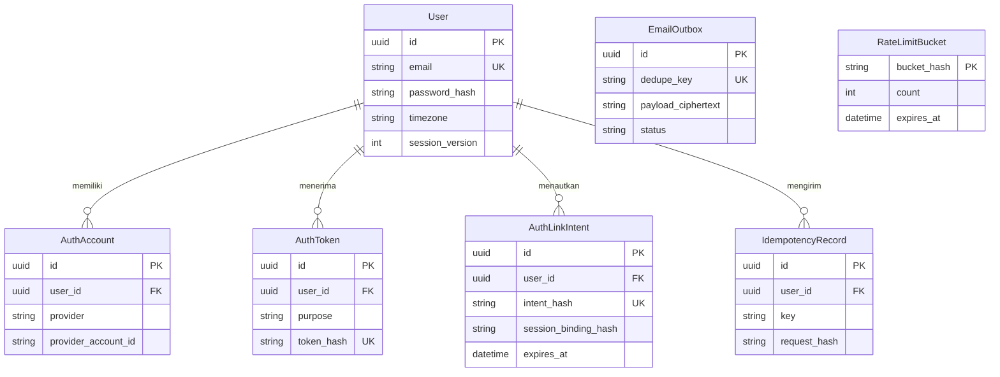
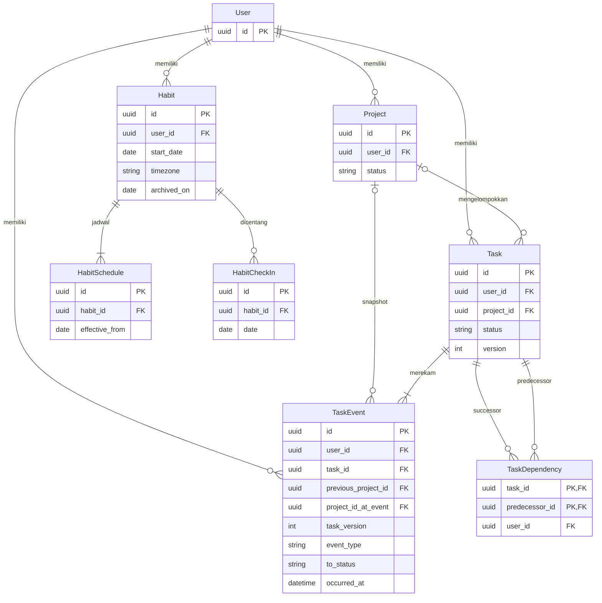
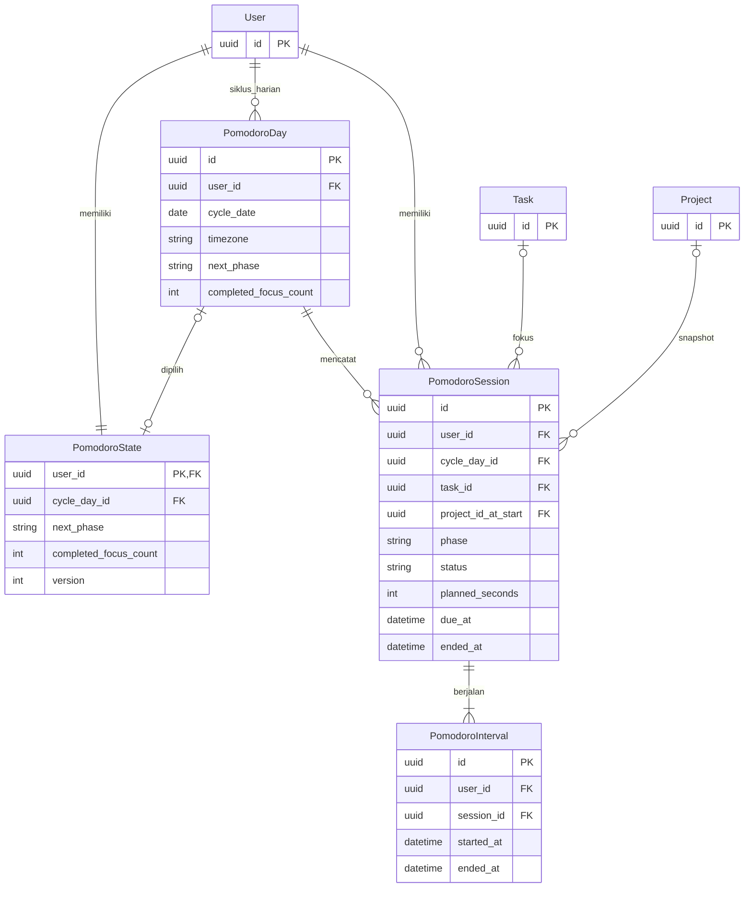
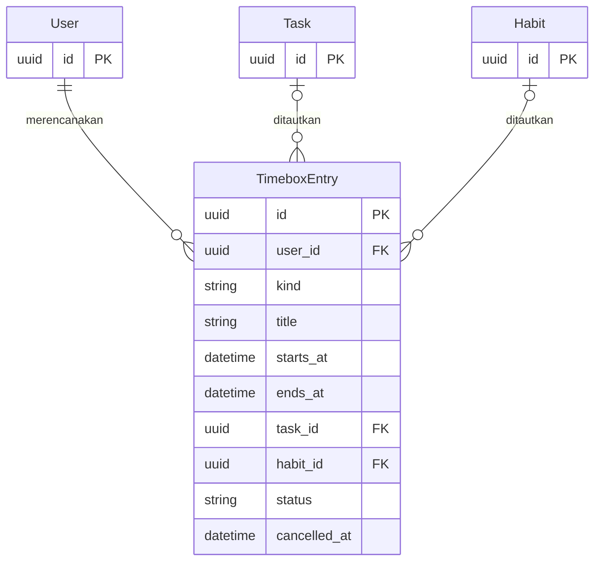
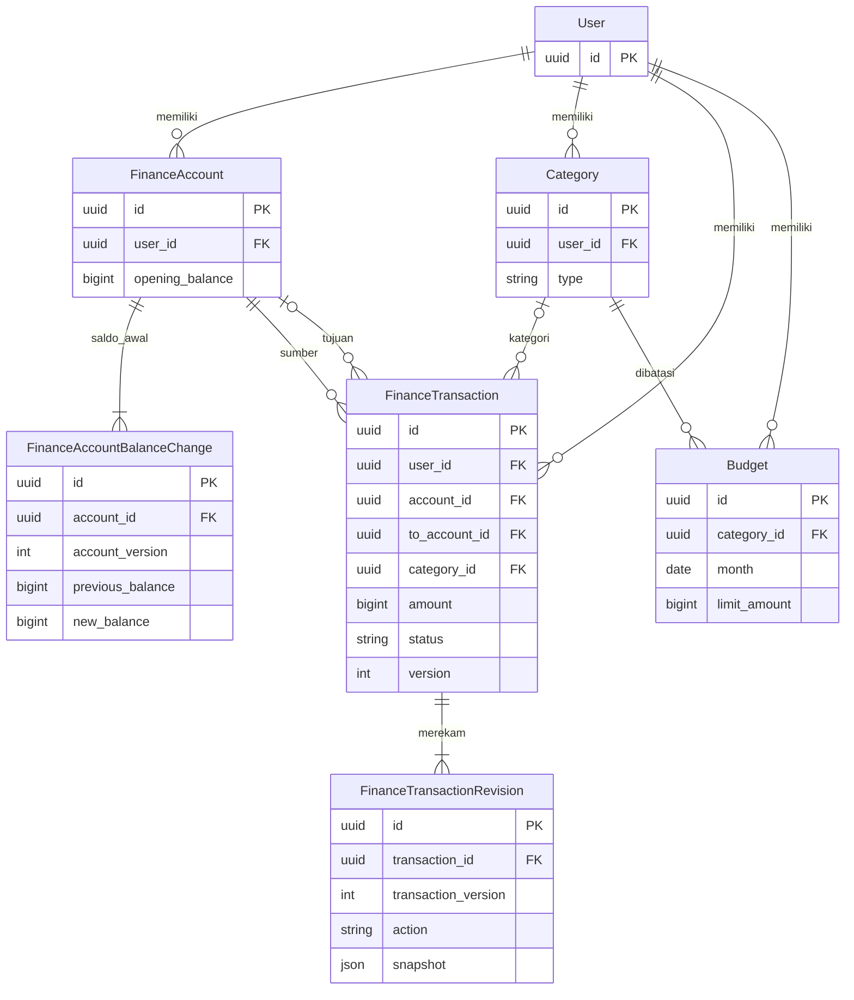
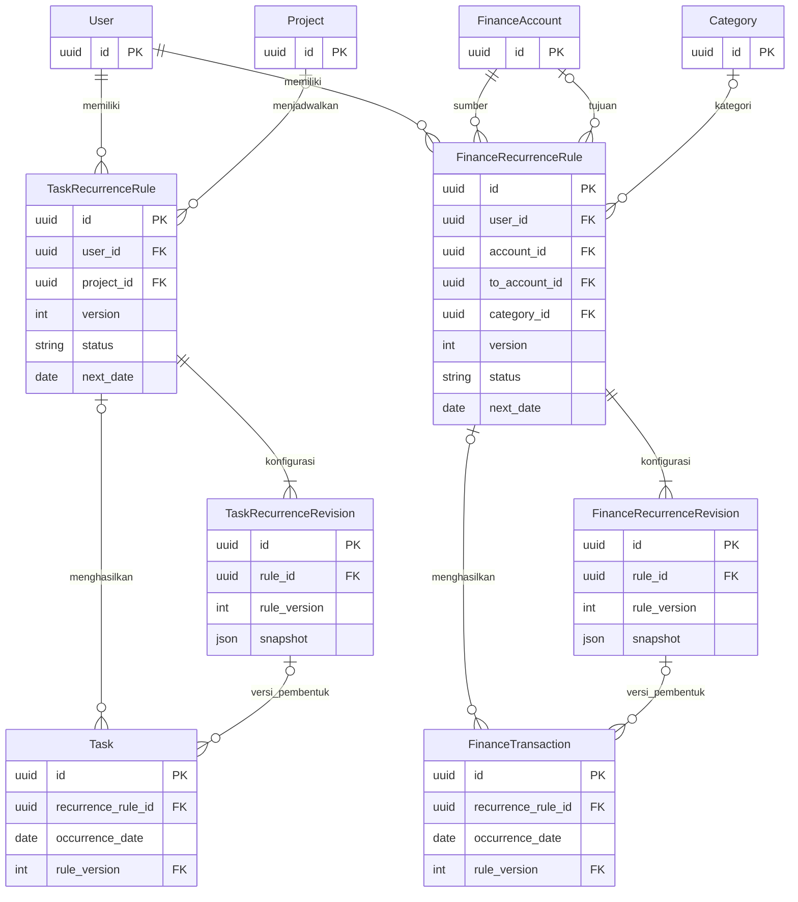

# ERD Tracker

Versi 0.3. Tanggal: 16 September 2026. Status: model rancangan, belum menjadi database. Field lengkap dan constraint berada di [SCHEMA](SCHEMA.md). Diagram hanya menunjukkan field identitas/relasi utama; `user_id` dan metadata mengikuti konvensi skema.

## Identitas dan sistem

EmailOutbox menggunakan recipient dan dedupe_key, tanpa FK pengguna agar pengiriman/cleanup tidak bergantung pada masa hidup token. RateLimitBucket merupakan tabel operasional. Tidak ada tabel sesi: sesi stateless memakai JWT dengan session_version pada User.

## Aktivitas, proyek, dan sejarah

TaskEvent dibuat bersama Task create dan tiap mutasi nyata. Laporan membaca event selesai/snapshot proyek, bukan status atau completed_at terkini. Snapshot previous_project_id juga menunjuk Project; relasinya tidak digambar ulang untuk menjaga keterbacaan. Habit wajib memiliki jadwal awal; archived_on disimpan sebagai batas historis tetap.

## Pomodoro

Satu sesi running/paused per pengguna, satu interval terbuka per sesi running. Pause menutup interval; resume menambah interval baru. Hanya focus memiliki referensi tugas/proyek; break tidak. Sesi terminal tetap tersimpan; hitungan fokus naik hanya sekali saat completed. State menunjuk Day, bukan sesi, sehingga tidak ada FK melingkar. Day unik per pengguna/tanggal dan menyimpan zona snapshot. Sesi lintas tengah malam tetap milik Day saat start; saat idle State beralih ke Day hari ini, memakai kembali Day yang sudah ada tanpa reset hitungan.

## Timebox — rencana dashboard

Class tidak memiliki FK aktivitas; Task/Habit menaut sumber sesuai kind; Focus boleh menaut Task. Rencana tidak memiliki relasi eksekusi otomatis ke PomodoroSession. Pembatalan mempertahankan baris; overlap jadwal diizinkan.

## Keuangan dan revisi

Transfer memakai sumber/tujuan dan kategori null; income/expense kategori wajib, tujuan null. Setiap transaksi memiliki revisi awal; setiap akun memiliki catatan saldo awal pertama. Revisi tidak dihitung sebagai transaksi saldo. Laporan uang memakai baris terkoreksi saat ini dan dapat ditelusuri ke revisi.

## Pengulangan dan versi pembentuk

Occurrence menyimpan rule_id/date/version; FK versi sebenarnya komposit sebagaimana SCHEMA. Worker maju cursor/expiry tanpa mengubah version konfigurasi. Rule stopped/expired dan revisinya tetap tersimpan. Tiga kolom occurrence baru ditambahkan di M4 setelah tabel aturan/revisi tersedia; data manual lama tetap null. Seluruh referensi bisnis satu pemilik, termasuk relasi User yang tidak digambar ulang.
